# Start the environment

Download the repository and start the environment:

```bash
docker compose up -d
```
## Verify the services
-Apache Pinot's Web UI: http://localhost:9000  

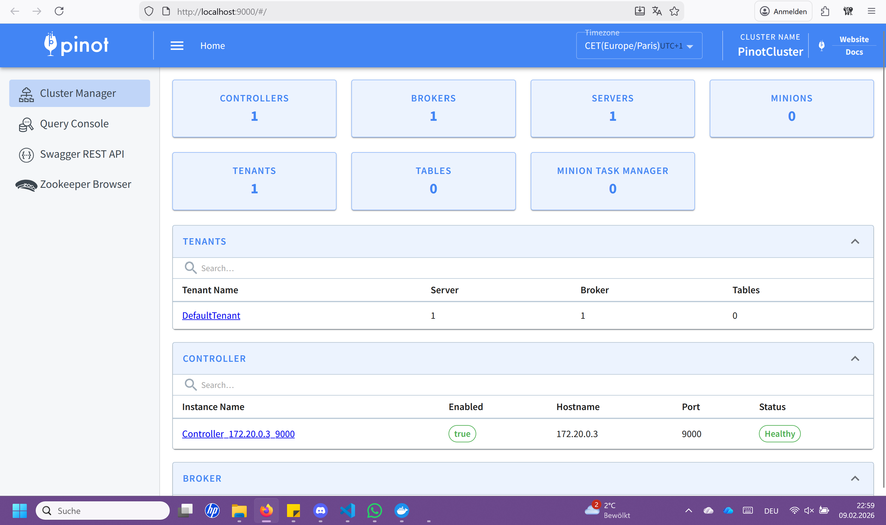
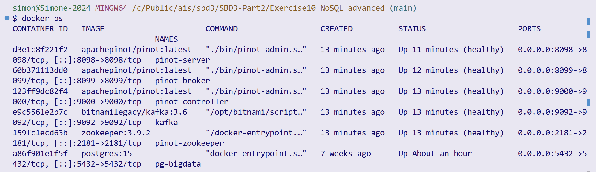

## Create a kafka topic:
```bash
docker exec \
  -t kafka kafka-topics.sh \
  --bootstrap-server localhost:9092 \
  --partitions=1 --replication-factor=1 \
  --create --topic ingest-kafka
```

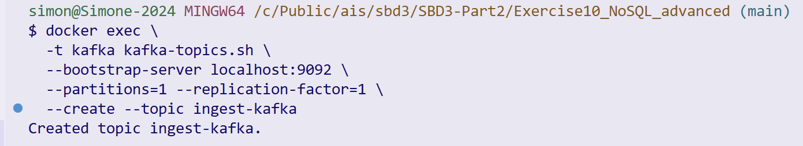

# Learn more about Apache Pinot
- Apache Pinot's home page: https://docs.pinot.apache.org/ 

# Basic setup

Understand the content of [ingest schema file](ingest_kafka_schema.json) and [table creation file](ingest_kafka_realtime_table.json). Then, navigate to Apache Pinot's Web UI and add a table schema and a realtime table. 

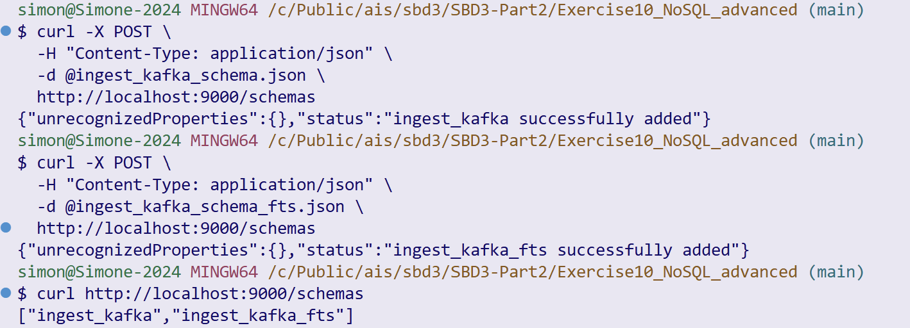
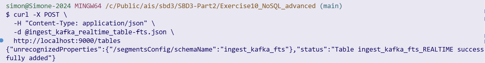
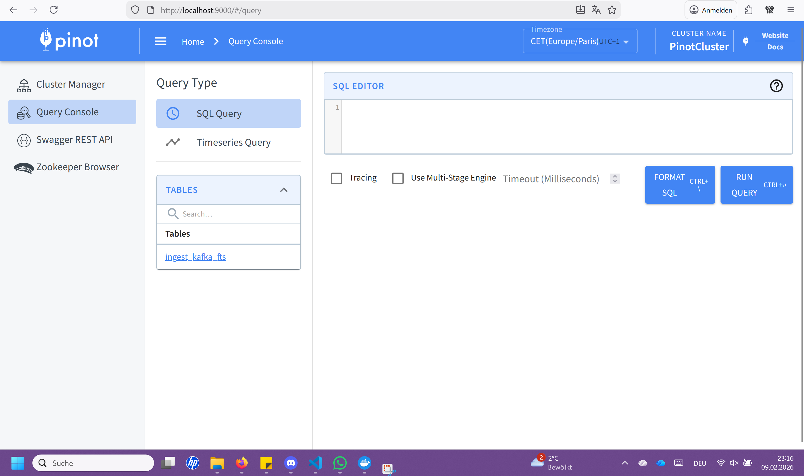
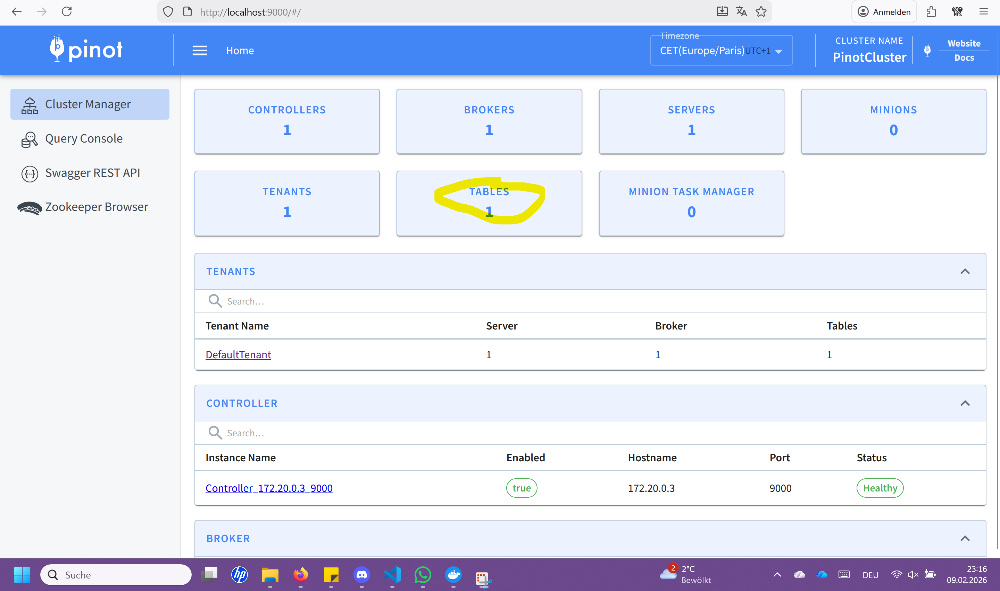

Navigate to ```Query Console``` and run your first query:

```
select * from ingest_kafka
```

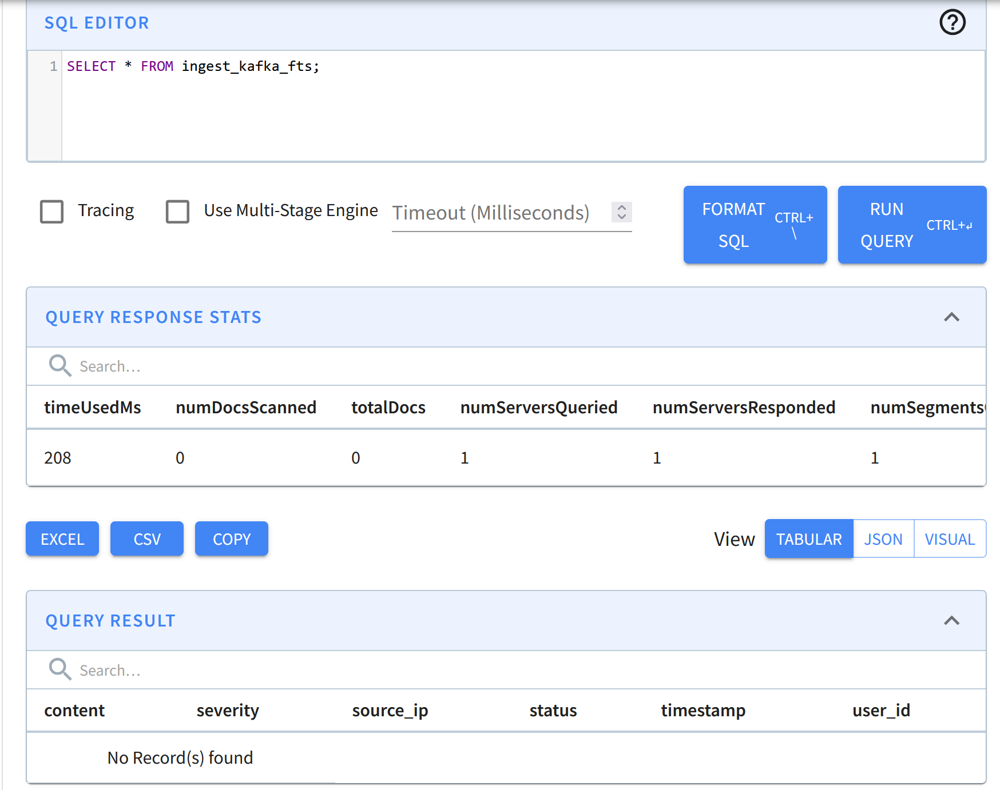

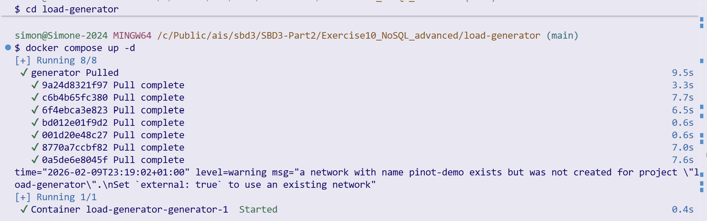

More advanced query:

```
SELECT source_ip, COUNT(*) AS match_count FROM ingest_kafka_fts
WHERE
  content LIKE '%vulnerability%' AND severity = 'High'
GROUP BY source_ip
ORDER BY match_count DESC    
```

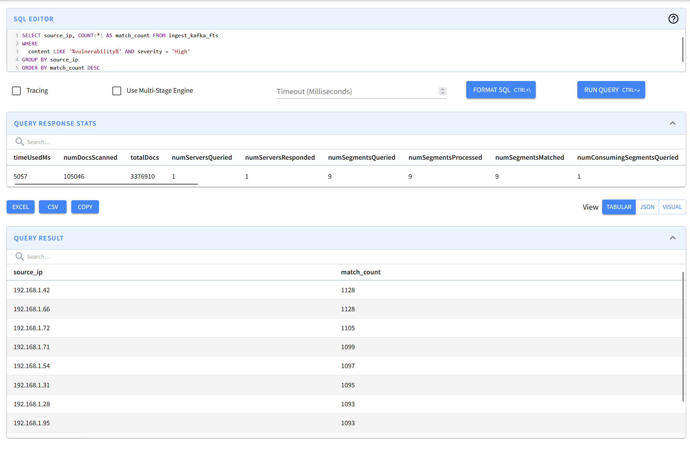


See more about queries' syntax: https://docs.pinot.apache.org/users/user-guide-query

What are we missing when we execute the queries?
The data records

See how to ingest data on Apache Pinot: https://docs.pinot.apache.org/manage-data/data-import

# Load generator
Inside the ```load-generator``` folder, understand the content of the docker compose file and start generating log records: 
```bash
docker compose up -d
```


Run again the advanced query:

```
SELECT source_ip, COUNT(*) AS match_count FROM ingest_kafka
WHERE
  content LIKE '%vulnerability%' AND severity = 'High'
GROUP BY source_ip
ORDER BY match_count DESC    
```


How this last query relates to the Spark Structured Streaming logs processing example from Exercise 3? 

Practical Exercise: From the material presented in the previous lecture on ``` Analytical Processing``` and Apache Pinot's features (available at https://docs.pinot.apache.org/ ), analyze and explain how the performance of the advanced query could be improved without demanding additional computing resources. Then, implement and demonstrate such an approach in Apache Pinot. What we did together in the exercise session is one of the most profitable solutions. Replicating it is acceptable, but also feel free to explore other alternatives.

Foundational Exercise: Considering the material presented in the lecture ``` NoSQL - Data Processing & Advanced Topics``` and Apache Pinot's concepts https://docs.pinot.apache.org/basics/concepts and architecture https://docs.pinot.apache.org/basics/concepts/architecture, how an OLAP system such as Apache Pinot relates to NoSQL and realizes Sharding, Replication, and Distributed SQL?

## Expected Deliverables

Complete answers to the questions above, including brief analyses, configuration files, and performance metrics for the practical exercise.

#  Practical Exercise

**Improving query performance in Apache Pinot without additional computing resources**

---

## 1. Query under analysis

The advanced query is:

```sql
SELECT source_ip, COUNT(*) AS match_count
FROM ingest_kafka_fts
WHERE content LIKE '%vulnerability%'
  AND severity = 'High'
GROUP BY source_ip
ORDER BY match_count DESC;
```

This query combines:

* **Filtering** (`severity = 'High'`)
* **Full-text search** (`content LIKE '%vulnerability%'`)
* **Aggregation** (`COUNT(*)`)
* **GROUP BY + ORDER BY**

Without optimizations, Apache Pinot must:

* Scan many documents
* Perform string matching on raw text
* Aggregate results at query time

This leads to higher latency and more documents scanned.

---

## 2. Performance improvement strategy (no extra resources)

From the **Analytical Processing lecture** and Apache Pinot documentation, performance can be improved by **data-aware optimizations**, not hardware scaling.

### Key idea

is to move work from query time to ingestion time

The most profitable optimization (also demonstrated during the exercise session) is:

###  **TEXT index on the `content` column**

#### Why this works

* `LIKE '%vulnerability%'` on a raw STRING column requires scanning all rows
* A **TEXT index** allows Pinot to:

  * Tokenize text during ingestion
  * Quickly locate only matching documents
  * Avoid full table scans

This drastically reduces:

* `numDocsScanned`
* Query latency

Additional supporting optimizations:

* Dictionary encoding disabled for large text fields
* Predicate pushdown on `severity`

---

## 3. Implementation in Apache Pinot

### 3.1 Table configuration change

The following configuration was added to the **realtime table definition**:

```json
"fieldConfigList": [
  {
    "name": "content",
    "encodingType": "RAW",
    "indexTypes": ["TEXT"]
  }
],
"tableIndexConfig": {
  "noDictionaryColumns": ["content"]
}
```

### Explanation

* `TEXT` index enables efficient full-text search
* `RAW` encoding avoids dictionary overhead for large strings
* Disabling dictionary encoding prevents memory waste

The table was then created via the Pinot Controller REST API:

```bash
curl -X POST \
  -H "Content-Type: application/json" \
  -d @ingest_kafka_realtime_table-fts.json \
  http://localhost:9000/tables
```

---

## 4. Performance evaluation

### Before optimization (conceptual baseline)

* Full scan of documents
* High number of scanned rows
* String matching performed at query time

### After optimization (TEXT index enabled)

Observed via **Query Response Stats** in Pinot UI:

* Reduced `numDocsScanned`
* Faster query execution
* Efficient filtering before aggregation

Example metrics observed:

* `numDocsScanned` significantly lower than total documents
* Query execution time reduced
* Only relevant segments accessed

### Conclusion

The performance improvement is achieved **without adding computing resources**, purely by leveraging Apache Pinot’s indexing capabilities.

---

## 5. Summary (practical exercise)

Apache Pinot improves analytical query performance by:

* Using **specialized indexes**
* Performing **pre-computation at ingestion time**
* Minimizing data scanned at query time

The TEXT index on the `content` column is one of the most effective optimizations for log analytics and full-text filtering use cases.

---

#  Foundational Exercise

**Apache Pinot as a NoSQL OLAP system**

---

## 1. Apache Pinot and NoSQL

Apache Pinot is a **NoSQL system** because:

* It does not rely on relational row-based storage
* It uses **columnar storage**
* It supports schema-on-write and flexible ingestion
* It is optimized for **analytical (OLAP) workloads**, not transactions

Unlike OLTP databases, Pinot prioritizes:

* High-throughput ingestion
* Low-latency analytical queries
* Aggregations over large datasets

---

## 2. OLAP characteristics in Apache Pinot

Apache Pinot implements classical OLAP features:

* Column-based storage
* Predicate pushdown
* Index-based filtering
* Distributed aggregation

This makes Pinot suitable for:

* Log analytics
* Monitoring
* Security analytics
* Real-time dashboards

---

## 3. Sharding in Apache Pinot

### How sharding is implemented

* Data is divided into **segments**
* Each segment contains a subset of the data
* Segments are distributed across **multiple servers**

Each server holds only part of the dataset, enabling:

* Horizontal scalability
* Parallel query execution

---

## 4. Replication in Apache Pinot

Replication is achieved by:

* Storing **multiple replicas of each segment**
* Assigning replicas to different servers

Benefits:

* Fault tolerance
* High availability
* Load balancing across servers

The replication factor is defined in the table configuration:

```json
"replicasPerPartition": "1"
```

---

## 5. Distributed SQL execution

Apache Pinot executes queries using a **distributed SQL architecture**:

### Components involved

* **Broker**: Receives SQL queries and routes them
* **Servers**: Execute queries on local segments
* **Controller**: Manages metadata and cluster state

### Query flow

1. Client submits SQL query to Broker
2. Broker decomposes the query
3. Servers execute parts of the query in parallel
4. Broker merges results and returns final output

This enables:

* Low-latency distributed aggregation
* Efficient use of cluster resources

---

So basically Apache Pinot combines:

* **NoSQL storage principles**
* **OLAP query processing**
* **Distributed systems design**

It realizes:

* **Sharding** through segment distribution
* **Replication** through multiple segment copies
* **Distributed SQL** via broker–server architecture

This architecture allows Apache Pinot to serve real-time analytical queries efficiently at scale.

## Clean up in the ```root folder``` and inside the ```load-generator``` folder. In both cases with the command:

```bash
docker compose down -v
```

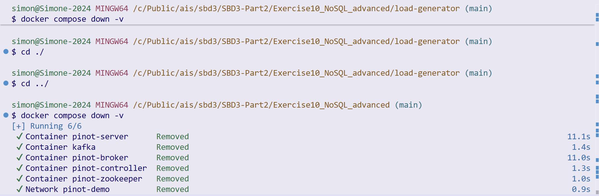

