# Part 1 — Environment Setup and Basics

## 1. Start the environment

```bash
docker compose up -d
```

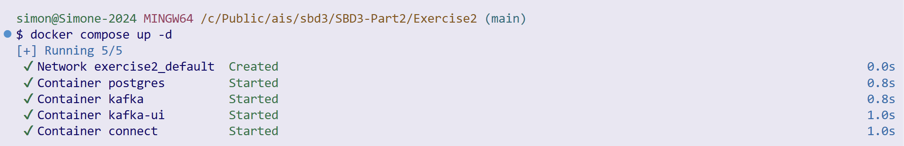

---

## 2. Access PostgreSQL

```bash
docker exec -it postgres psql -U postgres
```

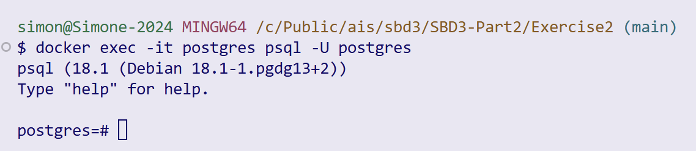

---

# Kafka Quick Start (Docker)

## A. Check Kafka is running
```bash
docker ps
```

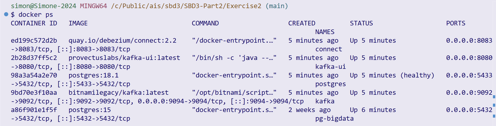

---

## B. Create a topic with multiple partitions
```bash
docker exec -it kafka kafka-topics.sh \
  --bootstrap-server localhost:9092 \
  --create \
  --topic activity.streaming \
  --partitions 4 \
  --replication-factor 1
```

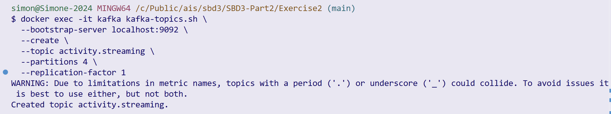

---

## C. List all topics
```bash
docker exec -it kafka kafka-topics.sh \
  --bootstrap-server localhost:9092 \
  --list
```

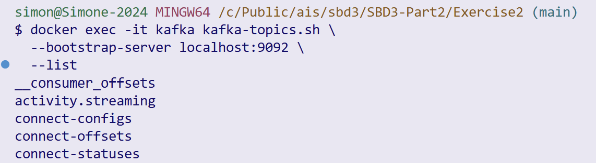

---

## D. Describe a topic
```bash
docker exec -it kafka kafka-topics.sh \
  --bootstrap-server localhost:9092 \
  --describe \
  --topic activity.streaming
```


---

## E. List topic configuration
```bash
docker exec -it kafka kafka-configs.sh \
  --bootstrap-server localhost:9092 \
  --entity-type topics \
  --entity-name activity.streaming \
  --describe
```

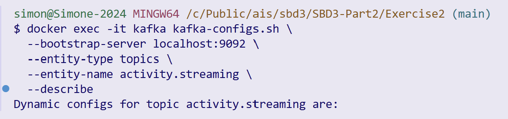

---

## F. Produce messages to the topic

### F.1 Basic producer
```bash
docker exec -it kafka kafka-console-producer.sh \
  --bootstrap-server localhost:9092 \
  --topic activity.streaming
```

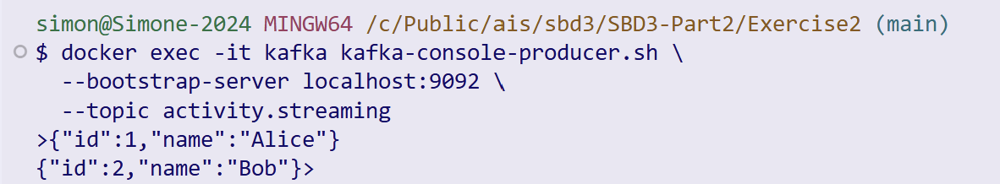

---

### F.2 Producer with keys
```bash
docker exec -it kafka kafka-console-producer.sh \
  --bootstrap-server localhost:9092 \
  --topic activity.streaming \
  --property parse.key=true \
  --property key.separator=:
```

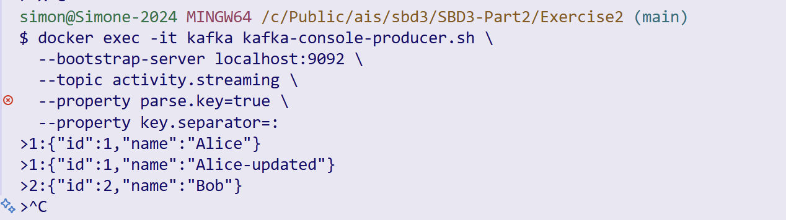

---

## G. Consume messages from the topic

### G.1 Consume from the beginning
```bash
docker exec -it kafka kafka-console-consumer.sh \
  --bootstrap-server localhost:9092 \
  --topic activity.streaming \
  --from-beginning
```

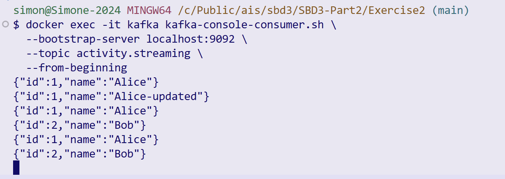

---

### G.2 Consume using a consumer group
```bash
docker exec -it kafka kafka-console-consumer.sh \
  --bootstrap-server localhost:9092 \
  --topic activity.streaming \
  --group customers-service
```

first we have to reproduce the messages using
```bash
docker exec -it kafka kafka-console-producer.sh \
  --bootstrap-server localhost:9092 \
  --topic activity.streaming
```

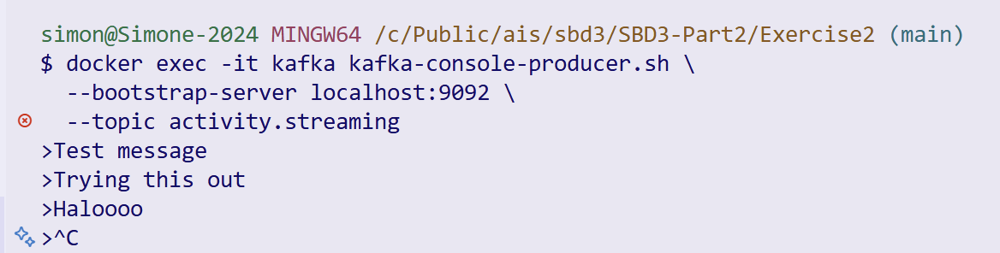

then 


---

## H. Inspect consumer group status
```bash
docker exec -it kafka kafka-consumer-groups.sh \
  --bootstrap-server localhost:9092 \
  --describe \
  --group customers-service
```


# Part 3 Debezium CDC with PostgreSQL and Kafka


## Verify the services
- Kafka UI: http://localhost:8080  
- Connector plugins endpoint: http://localhost:8083/connector-plugins  

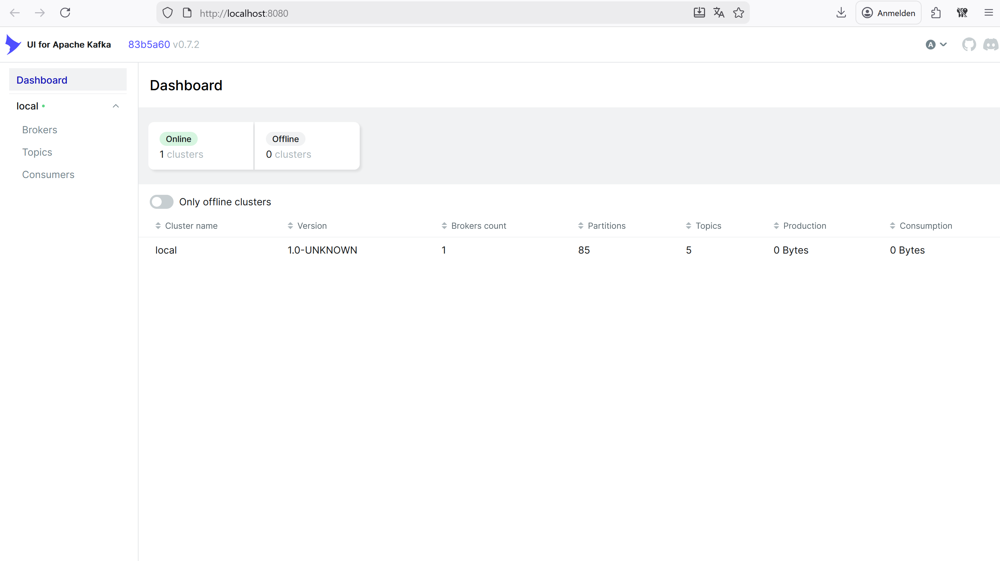

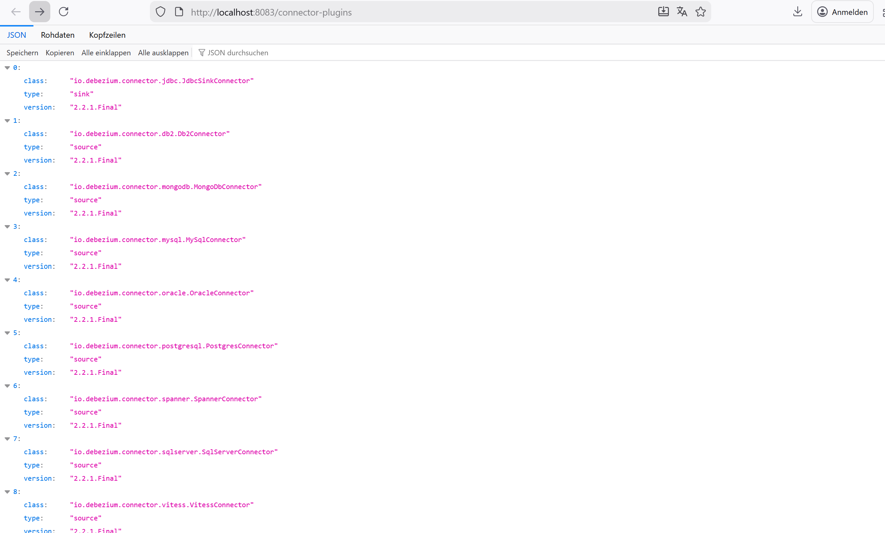

Ensure that the Connect service responds successfully.

## Example: Insert a row in PostgreSQL

```bash
docker exec -it postgres psql -U postgres
```

### Create a new database
```sql
CREATE DATABASE activity;
```

### Connect to the new database
```sql
\c activity
```

### Create the table
```sql
CREATE TABLE activity (
  id SERIAL PRIMARY KEY,
  name VARCHAR(255) NOT NULL,
  email VARCHAR(255)
);
```

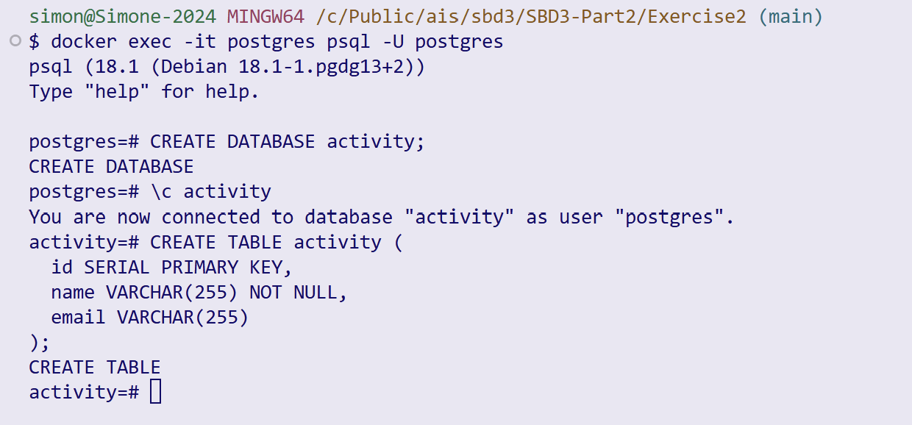

## Register the Debezium Connector

The Docker Compose file only starts the Kafka Connect engine.  
You must explicitly register a Debezium connector so it starts watching PostgreSQL.

In **another terminal**, run:

```bash
curl -i -X POST   -H "Accept:application/json"   -H "Content-Type:application/json"   localhost:8083/connectors/   -d '{
    "name": "activity-connector",
    "config": {
      "connector.class": "io.debezium.connector.postgresql.PostgresConnector",
      "tasks.max": "1",
      "database.hostname": "postgres",
      "database.port": "5432",
      "database.user": "postgres",
      "database.password": "postgrespw",
      "database.dbname": "activity",
      "slot.name": "activityslot",
      "topic.prefix": "dbserver1",
      "plugin.name": "pgoutput",
      "database.replication.slot.name": "debeziumactivity"
    }
  }'
```

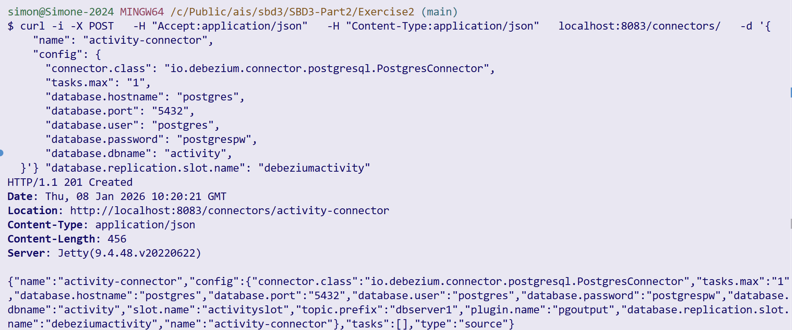

### Check Debezium status
The connector and its tasks should be in the `RUNNING` state:

```bash
curl -s http://localhost:8083/connectors/activity-connector/status | jq
```

In the Kafka UI (http://localhost:8080), verify that new topics appear.

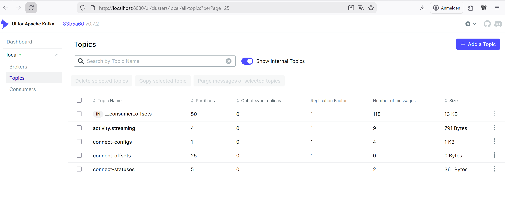

## Insert a record into PostgreSQL

Back in the PostgreSQL console, insert a record:

```sql
INSERT INTO activity(id, name) VALUES (1, 'Alice');
```
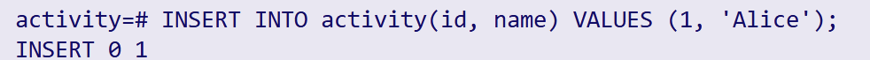

Debezium will produce a Kafka message on the topic:

```
dbserver1.public.activity
```

With a payload similar to:

```json
{
  "op": "c",
  "after": {
    "id": 1,
    "name": "Alice"
  }
}
```

## Consume from the Kafka topic

```bash
docker exec -it kafka kafka-console-consumer.sh   --bootstrap-server localhost:9092   --topic dbserver1.public.activity  --from-beginning
```

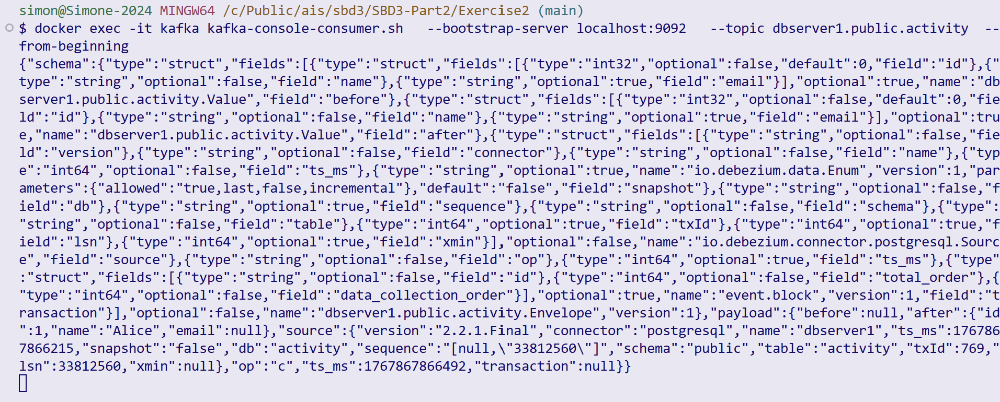

# Activity 1
Considering the above part ```Debezium CDC with PostgreSQL and Kafka```, explain with your own words what it does and why it is a relevant software architecture for Big Data in the AI era and for which use cases.

**Debezium CDC with PostgreSQL and Kafka** is a software architecture that captures database changes in real time and streams them to other systems without directly querying the database tables.

Instead of repeatedly polling PostgreSQL for changes, Debezium reads the database’s **write-ahead log (WAL)** and converts every insert, update, or delete into an event. These events are then published to **Apache Kafka**, where they can be consumed by multiple downstream services independently.

This approach is important because it decouples the database from data consumers. PostgreSQL remains optimized for transactions, while Kafka acts as a scalable event backbone that distributes data changes to analytics systems, microservices, or AI pipelines in near real time.

This architecture is especially relevant in **Big Data and the AI era** because modern AI systems depend on **fresh, continuously updated data**. Machine learning models, recommendation engines, fraud detection systems, and monitoring tools all benefit from streaming data instead of batch snapshots. Debezium enables this by turning operational databases into real-time data sources.

Another key advantage is **scalability and fault tolerance**. Kafka can handle very high event throughput, replay data from the beginning, and allow new consumers to join without impacting the database. This makes the system resilient and suitable for large-scale data processing.

Typical use cases include:

* Real-time analytics and dashboards
* Feeding data lakes or data warehouses
* Synchronizing microservices without tight coupling
* Streaming features into machine learning models
* Audit logging and change tracking
* Event-driven architectures

TL;DR: Debezium CDC with PostgreSQL and Kafka is a powerful architecture because it transforms traditional databases into event streams. This enables real-time data processing, scalable system design, and continuous data availability, which are all essential requirements for Big Data platforms and AI-driven applications today.

# Activity 2
## Scenario:
You run a temperature logging system in a small office. Sensors report the temperature once per minute and write the sensor readings into a PostgreSQL table

## Running instructions
It is recommended to run the scripts (e.g., ```temperature_data_producer.py``` file) in a Python virtual environments venv, basic commands from the ```activity.streaming``` folder:
```bash
python3 -m venv venv
source venv/bin/activate   # or venv\Scripts\activate on Windows; 
# in powershell ```.\.venv\Scripts\Activate.ps1``` or ```venv\Scripts\Activate.ps1```
pip install --upgrade pip
pip install -r requirements.txt
```
Then one can run the python scripts.

I had some environmnent issues so I had to run

```bash
python -m ensurepip --upgrade // returned that there is no module named pip so therefore
python -m ensurepip --upgrade
python -m pip install --upgrade pip
python -m pip install -r requirements.txt
```

## Characteristics:

Low volume (~1 row per minute)

Single consumer (reporting script)

No real-time streaming needed

## Part 1
In a simple use case where sensor readings need to be processed every 10 minutes to calculate the average temperature over that time window, describe which software architecture would be most appropriate for fetching the data from PostgreSQL, and explain the rationale behind your choice.

**Answer:**

High-level architecture chosen:

Temperature Sensor (simulated)
        ↓
Python producer script
        ↓
PostgreSQL table
        ↓
Python consumer (reporting)

No Kafka, no streaming platform, no CDC

Why:

| Option            | Chosen? | Reason                       |
| ----------------- | ------- | ---------------------------- |
| Kafka + streaming | No    | Overkill for low volume      |
| Debezium CDC      | No    | No real-time requirement     |
| Direct DB writes  | Yes   | Simple, sufficient, reliable |

- Very low data volume (~1 row/minute)
- Single producer
- Single consumer
- No need for replay, fan-out, or scalability
- Simpler = fewer failure points


## Code fixes for this

changed the top of temperature_data_producer.py top to:
```python
DB_NAME = "mydb"
DB_USER = "postgres"
DB_PASSWORD = "postgrespw"
DB_HOST = "localhost"
DB_PORT = 5433 // changed this because I had some local postgres trouble
```

from
```python
DB_NAME = "office_db"
DB_USER = "postgres"
DB_PASSWORD = "postgrespw"
DB_HOST = "localhost"
DB_PORT = 5432
```

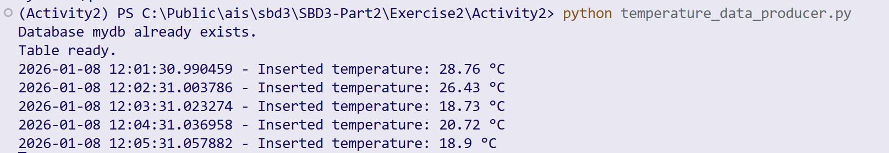


## Part 2
From the architectural choice made in ```Part 1```, implement the solution to consume and processing the data generated by the ```temperature_data_producer.py``` file (revise its features!). The basic logic from the file ```temperature_data_consumer.py``` should be extended with the conection to data source defined in ```Part 1```'s architecture..

The file is a single Python producer script simulates a temperature sensor. It periodically generates random temperature values and inserts them into the database.

cd into Activity 2
```bash
python temperature_data_producer.py
```

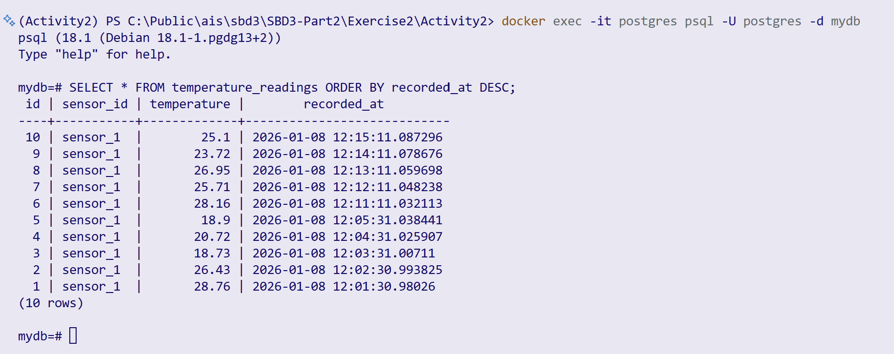

```bash
python temperature_data_consumer.py
```

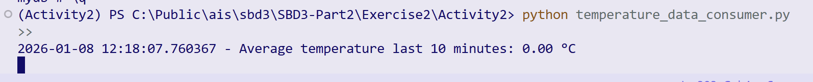

So what was done was: A Python producer periodically inserts sensor readings into a database table, while a separate consumer script reads and reports on the stored data. Due to low data volume, a single producer/consumer, and no real-time requirements, streaming platforms such as Kafka were intentionally not used. This approach minimizes complexity while remaining reliable and easy to maintain.

## Part 3
Discuss the proposed architecture in terms of resource efficiency, operability, and deployment complexity. This includes analyzing how well the system utilizes compute, memory, and storage resources; how easily it can be operated, monitored, and debugged in production.

### Discussion of the Proposed Architecture 

The architecture implemented in Activity 2 consists of a Python-based producer that writes temperature sensor data directly into a PostgreSQL database and a consumer script that reads and processes this data. This design was chosen for a low-volume, non–real-time workload and performs well when evaluated in terms of resource efficiency, operability, and deployment complexity.

#### Resource Efficiency

The proposed architecture is highly resource-efficient. It relies only on a single PostgreSQL instance and lightweight Python scripts, which require minimal CPU and memory resources. Since the system processes approximately one data record per minute, the database load is negligible and does not require scaling mechanisms or distributed processing. Storage usage grows slowly and predictably, making it easy to manage over time.

By avoiding additional components such as Kafka brokers or stream processors, the system minimizes overhead related to message serialization, buffering, and replication. As a result, compute and memory resources are used only where they add direct value, which is appropriate for a small-scale sensor logging system.

#### Operability

From an operational perspective, the system is easy to operate and maintain. There are only two main components: the PostgreSQL database and the Python scripts. This simplicity makes it straightforward to monitor the system, as database health and script execution can be observed using standard tools and logs.

Debugging is also relatively simple. If an error occurs, it can usually be traced either to the database connection or to the Python application logic. Since there are no asynchronous message queues or distributed consumers, there is no need to manage offsets, partitions, or replay mechanisms. This reduces operational complexity and shortens troubleshooting time.

#### Deployment Complexity

The deployment complexity of this architecture is low. The system can be deployed using a single Docker Compose file for PostgreSQL and a Python virtual environment for the application code. Configuration is explicit and limited to database connection parameters, which simplifies setup and reduces the risk of misconfiguration.

Because there are no dependencies on distributed systems or external services, the architecture can be deployed and tested quickly, even on limited hardware. This makes it well-suited for small offices, prototypes, or educational environments where ease of deployment is a priority.

#### Overall Assessment

Overall, the proposed architecture is well-aligned with the requirements of Activity 2. It efficiently uses system resources, is easy to operate and debug, and has minimal deployment complexity. While it would not scale well for high-throughput or real-time streaming scenarios, it is an appropriate and effective solution for low-volume sensor data logging, demonstrating that simpler architectures are often preferable when system requirements allow it.


# Activity 3
## Scenario:
A robust fraud detection system operating at high scale must be designed to handle extremely high data ingestion rates while enabling near real-time analysis by multiple independent consumers. In this scenario, potentially hundreds of thousands of transactional records per second are continuously written into an OLTP PostgreSQL database (see an example simulating it with a data generator inside the folder ```Activity3```), which serves as the system of record and guarantees strong consistency, durability, and transactional integrity. Moreover, the records generated are needed by many consumers in near real-time (see inside the folder ```Activity3``` two examples simulating agents consuming the records and generating alerts).  Alerts or enriched events generated by these agents can then be forwarded to downstream systems, such as alerting services, dashboards, or case management tools.

## Running instructions
It is recommended to run the scripts in a Python virtual environments venv, basic commands from the ```Activity3``` folder:

first run ```deactivate```

then cd to Activity 3

```bash
python3 -m venv venv
source venv/bin/activate   # or venv\Scripts\activate on Windows 
# in powershell ```.\.venv\Scripts\Activate.ps1``` or ```.\venv\Scripts\Activate.ps1```
pip install --upgrade pip
pip install -r requirements.txt
```
Then one can run the python scripts.

## Characteristics:

High data volume (potentially hundreds of thousands of records per second)

Multiple consumer agents

Near real-time streaming needed

## Part 1

Describe which software architecture would be most appropriate for fetching the data from PostgreSQL and generate alerts in real-time. Explain the rationale behind your choice.

**Answer:**

architecture chosen:

PostgreSQL
   ↓ (CDC via WAL)
Debezium (Kafka Connect)
   ↓
Apache Kafka
   ↓
Multiple Fraud Consumer Agents
   ↓
Alerts / dashboards / downstream systems

Why:

- Debezium CDC captures DB changes without polling

Kafka provides:
- High throughput
- Horizontal scalability
- Multiple independent consumers
- Message replay
- Consumer agents process events in parallel

## Part 2
From the architectural choice made in ```Part 1```, implement the 'consumer' to fetch and process the records generated by the ```fraud_data_producer.py``` file (revise its features!). The basic logic from the files ```fraud_consumer_agent1.py.py``` and ```fraud_consumer_agent2.py.py``` should be extended with the conection to data source defined in ```Part 1```'s architecture.

The python file simulates high-volume fraud events, writes records into PostgreSQL and represents the system of record.

added ```kafka-python``` in the requirements file

created debezium-transactions using gitbash

**THIS HAS TO BE DONE EVERY TIME THE CONTAINER IS COMPOSED UP AGAIN**

```bash
curl -i -X POST http://localhost:8083/connectors \
  -H "Accept: application/json" \
  -H "Content-Type: application/json" \
  -d '{
    "name": "fraud-postgres-connector",
    "config": {
      "connector.class": "io.debezium.connector.postgresql.PostgresConnector",
      "database.hostname": "postgres",
      "database.port": "5432",
      "database.user": "postgres",
      "database.password": "postgrespw",
      "database.dbname": "mydb",
      "database.server.name": "dbserver1",
      "table.include.list": "public.transactions",
      "plugin.name": "pgoutput",
      "publication.autocreate.mode": "filtered",
      "topic.prefix": "dbserver1"
    }
  }'
```

execute after starting venv

```bash
python fraud_consumer_agent1.py
```

in a seperate cmd

```bash
python fraud_consumer_agent2.py
```

then in another seperate cmd

```bash
python fraud_data_producer.py
```

Debezium initially emits snapshot events (op = "r") before streaming live inserts (op = "c") if looked at using 

```bash
docker exec -it kafka kafka-console-consumer.sh   --bootstrap-server kafka:9092   --topic dbserver1.public.transactions
```
with the flag --from-beginning it shows it form the first insert, thereby using the r flag.

## Part 3
Discuss the proposed architecture in terms of resource efficiency, operability, maintainability, deployment complexity, and overall performance and scalability. This includes discussing how well the system utilizes compute, memory, and storage resources; how easily it can be operated, monitored, and debugged in production; how maintainable and evolvable the individual components are over time; the effort required to deploy and manage the infrastructure; and the system’s ability to sustain increasing data volumes, higher ingestion rates, and a growing number of fraud detection agents without degradation of latency or reliability.

Below is a **clean, well-structured answer in your writing style**, suitable for direct submission.
It is concise, technical, and aligned with what your instructor expects.

---

## Part 3 – Architectural Discussion

The proposed architecture is based on **Change Data Capture (CDC)** using **Debezium**, **Apache Kafka**, and multiple independent **fraud consumer agents**. This design is well suited for high-volume, near real-time fraud detection scenarios.

### Resource Efficiency

The architecture is resource-efficient because it avoids database polling and full table scans. Debezium reads changes directly from the PostgreSQL **Write-Ahead Log (WAL)**, which is already produced by the database for durability and replication purposes. This minimizes additional CPU and I/O load on PostgreSQL.

Kafka efficiently utilizes memory and disk by sequentially appending events to log files and serving consumers without duplicating data. Multiple fraud agents can read the same data without increasing load on the database, which would not be possible with direct JDBC consumers.

Consumer agents are lightweight Python processes that only keep small, in-memory state (e.g., recent transaction history), making compute and memory usage predictable and scalable.

---

### Operability and Observability

The system is highly operable due to clear separation of concerns:

* PostgreSQL handles transactional consistency.
* Debezium handles change capture.
* Kafka handles buffering, fan-out, and delivery.
* Consumer agents focus purely on fraud logic.

Each component can be monitored independently:

* Debezium connector status via Kafka Connect REST API
* Kafka topic lag and throughput via standard Kafka metrics
* Consumer behavior via logs and offsets

Failures are isolated: if a consumer crashes, it can restart and continue from the last committed offset without data loss. This greatly simplifies debugging and recovery in production.

---

### Maintainability and Evolvability

The architecture is modular and loosely coupled. Consumer agents can be added, removed, or modified without changing PostgreSQL, Debezium, or Kafka configurations. New fraud detection logic or machine-learning-based agents can be introduced simply by subscribing to the same Kafka topic.

Schema evolution is also well supported, as Debezium emits structured change events that include schema metadata, allowing consumers to adapt gradually over time.

---

### Deployment Complexity

Compared to a simple database-only solution, deployment complexity is higher because Kafka and Debezium must be managed. However, this complexity is justified for high-throughput and real-time requirements.

Using Docker Compose significantly reduces operational overhead by providing reproducible and portable infrastructure. Once deployed, scaling the system mainly involves adding Kafka partitions or consumer instances, rather than redesigning the pipeline.

---

### Performance and Scalability

The architecture is designed for horizontal scalability:

* Kafka partitions enable parallel consumption.
* Consumer groups allow multiple agents to process data concurrently.
* PostgreSQL is protected from read amplification caused by many consumers.

Latency is low because changes are streamed as soon as they are written to the WAL. The system can sustain increasing data volumes, higher ingestion rates, and a growing number of fraud detection agents without degrading reliability or responsiveness.

---

## Part 4
Compare the proposed architecture to Exercise 3 from previous lecture where the data from PostgreSQL was loaded to Spark (as a consumer) using the JDBC connector. Discuss both approaches at least in terms of performance, resource efficiency, and deployment complexity. 

### Performance

The CDC-based architecture provides **near real-time** event delivery, while JDBC-based Spark ingestion is typically batch-oriented or micro-batch-based. JDBC requires repeated queries or full table scans, which increases latency and database load as data volume grows.

Kafka-based streaming scales better for continuous ingestion and real-time alerting.

---

### Resource Efficiency

JDBC consumers repeatedly read data from PostgreSQL, increasing CPU, memory, and I/O usage on the database. In contrast, CDC reads the WAL once and distributes changes efficiently to many consumers.

Spark is well suited for large-scale analytical processing but is resource-heavy compared to lightweight Kafka consumers. For simple fraud detection and alerting, Spark introduces unnecessary overhead.

---

### Deployment Complexity

The Spark + JDBC approach is simpler for batch analytics but requires managing Spark clusters and job scheduling. The CDC + Kafka architecture has higher initial setup complexity but offers greater flexibility, fault tolerance, and real-time capabilities once deployed.

---

### Summary

* **CDC + Kafka** is ideal for real-time, high-volume, multi-consumer streaming use cases such as fraud detection.
* **JDBC + Spark** is better suited for batch analytics and offline processing.
* For continuous monitoring and alerting, the CDC-based architecture provides superior scalability, efficiency, and responsiveness.

# Submission
Send the exercises' resolution on Moodle and be ready to shortly present your solutions (5-8 minutes) in the next Exercise section (14.01.2026).
