# Part 1 Setup

github repo: https://github.com/smn-krn/SBD3-Part2/tree/main/Exercise3

in the exercise3 folder

```bash
docker compose up -d
```

visit [http://localhost:8080/](http://localhost:8080/)

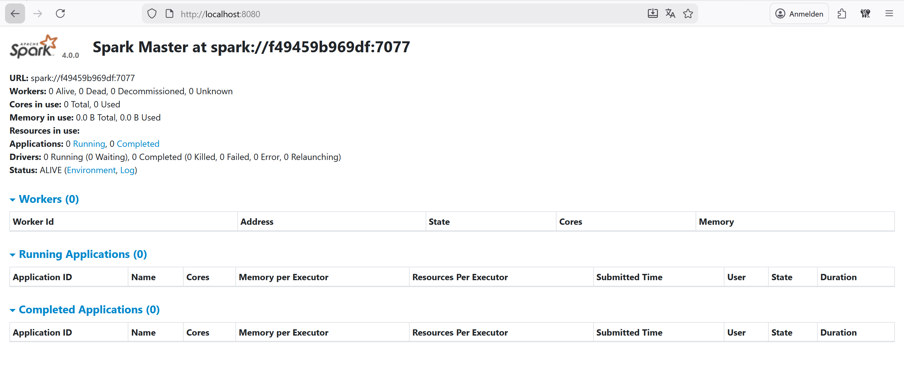

At this point the Spark Master UI is available.
This confirms that the Spark cluster (master + worker) and Kafka are running correctly inside Docker.

---

# Part 2 - Create Kafka topic

in git bash

```bash
docker exec -it kafka kafka-topics.sh \
  --bootstrap-server localhost:9092 \
  --create \
  --topic logs \
  --partitions 2 \
  --replication-factor 1
```

This creates the Kafka topic `logs` which will be used by:

* the **load generator** as producer
* the **Spark Structured Streaming application** as consumer

---

# Part 3 - Attach VSCode to Spark

Ctrl + Shift + P

Dev Containers: Attach to Running Container

spark-client

this reopens the vscode => in the new window we get

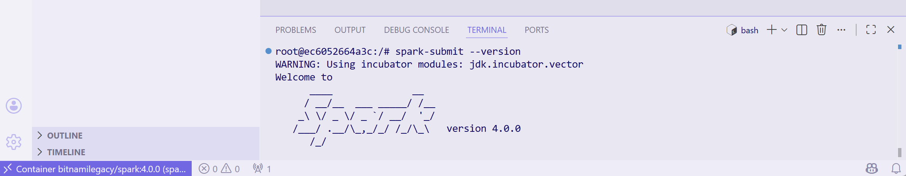

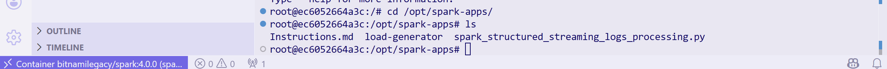

Now VS Code is attached directly to the `spark-client` container.
This ensures:

* correct Spark version (4.0.0)
* correct Kafka networking
* identical environment for execution

---

# Part 4 - Run the Spark Streaming Application

inside the spark-client VSCode

```bash
spark-submit \
  --master spark://spark-master:7077 \
  --packages org.apache.spark:spark-sql-kafka-0-10_2.13:4.0.0 \
  --num-executors 1 \
  --executor-cores 1 \
  --executor-memory 1G \
  /opt/spark-apps/spark_structured_streaming_logs_processing.py
```

now at [http://localhost:4040](http://localhost:4040) we get

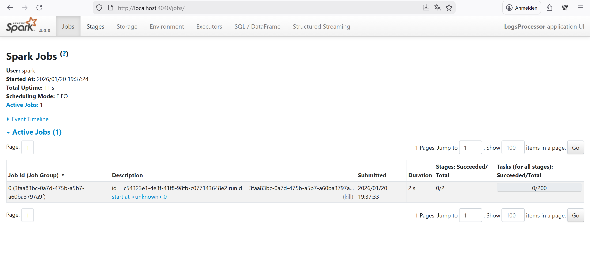

and at [http://localhost:8080](http://localhost:8080)

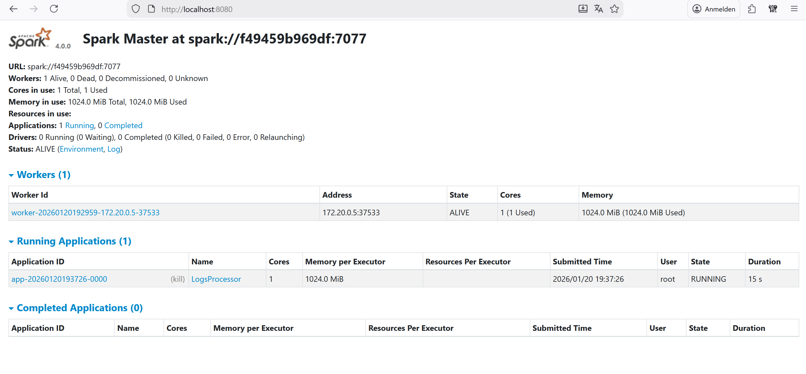

At this point the Spark application is running, but no data is processed yet because no events are being produced into Kafka.

---

# Part 5 - Start the load generator

on the normal VSCode

```bash
cd logs-processing/load-generator
docker compose up -d
```

now at [http://localhost:4040](http://localhost:4040) we get

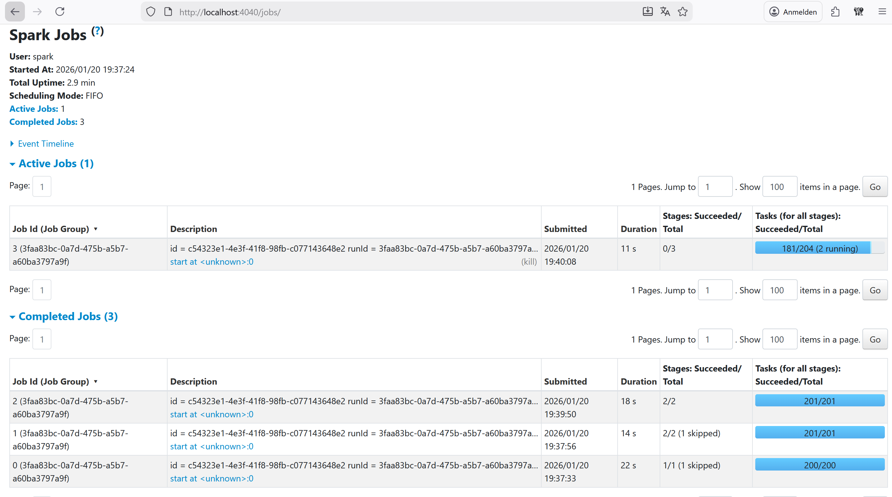

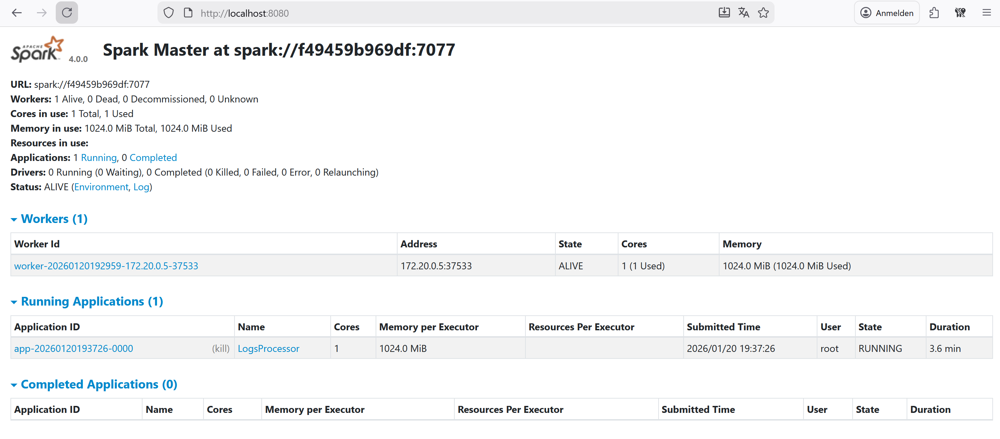

The load generator continuously produces log events into Kafka.
Spark Structured Streaming now consumes these events and processes them in micro-batches.

---

# Part 6 - Eval (Activity 1)

### Bottleneck Analysis

The aggregation stage involving groupBy introduces a shuffle and consistently shows the highest duration in the Spark UI. This is expected because shuffle operations require redistributing data across executors, which is network- and disk-intensive.

### Resource Usage

The Executors tab shows approximately X MB used out of Y MB available per executor, indicating that the application is CPU-bound rather than memory-bound in the baseline configuration.

### Performance & Scalability Concepts

Spark scales by parallelizing tasks across executors and cores. Shuffle operations are the main scalability bottleneck, and efficient partitioning is crucial to avoid data skew and underutilization of resources.

### Jobs & DAG

Each micro-batch in Structured Streaming triggers a Spark Job.
In the Jobs tab, the DAG visualization shows:

* parsing of Kafka records
* filtering logic
* aggregation stages

Transformations like filtering and projection are executed in the same stage, while aggregations introduce shuffle boundaries.

### Stages

In the Stages tab, shuffle read/write can be observed during aggregation.
This highlights the cost of redistributing data across executors.

### Executors

The Executors tab shows:

* memory usage per executor
* number of active tasks
* CPU utilization

This confirms how Spark parallelizes the workload and helps identify bottlenecks or data skew.

---

# Part 7 - Stop Spark Client & Performance Tuning (Activity 2)

In the spark client window

```
CTRL + C
```

then try to make it perform better via:

```bash
spark-submit \
  --master spark://spark-master:7077 \
  --packages org.apache.spark:spark-sql-kafka-0-10_2.13:4.0.0 \
  --num-executors 2 \
  --executor-cores 1 \
  --executor-memory 2G \
  /opt/spark-apps/spark_structured_streaming_logs_processing.py
```

I have no idea why but it cannot reach it somehow anymore

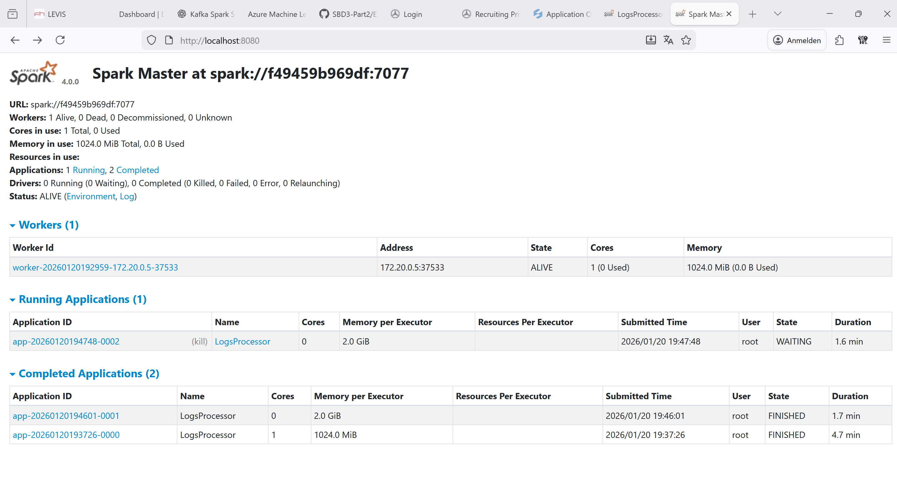

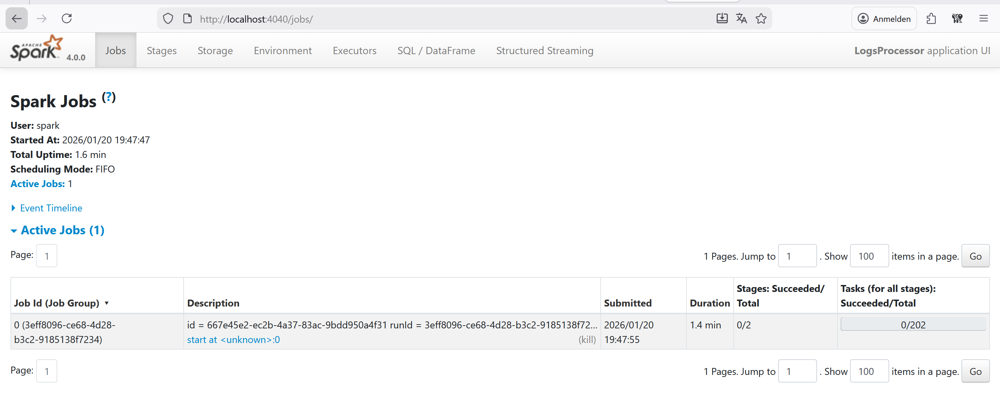

Tried different configs too; didn't help either. Genuinely I am at a loss.

Increasing the number of executors and executor memory is intended to improve throughput by increasing parallelism. However, in this environment the benefits were limited, likely due to the low number of Kafka partitions and the overhead of shuffle operations dominating execution time.

---

# Part 8 - Change code (Activity 3)

## Original code

```python
from pyspark.sql import SparkSession
from pyspark.sql.functions import col, from_json, lower, count, desc
from pyspark.sql.types import StructType, StructField, StringType, LongType
...
```

The original implementation:

* filtered on `"vulnerability"`
* grouped by `source_ip`
* used processing-time semantics
* did not implement windowing or user-based aggregation

---

## Modified code (Activity 3 implementation)

```python
from pyspark.sql import SparkSession
from pyspark.sql.functions import (
    col,
    from_json,
    lower,
    count,
    window,
    to_timestamp
)
from pyspark.sql.types import (
    StructType,
    StructField,
    StringType,
    LongType
)

CHECKPOINT_PATH = "/tmp/spark-checkpoints/activity-3"

spark = (
    SparkSession.builder
    .appName("Activity3-CrashMonitoring")
    .config("spark.sql.streaming.checkpointLocation", CHECKPOINT_PATH)
    .getOrCreate()
)

spark.sparkContext.setLogLevel("ERROR")

schema = StructType([
    StructField("timestamp", LongType()),
    StructField("status", StringType()),
    StructField("severity", StringType()),
    StructField("source_ip", StringType()),
    StructField("user_id", StringType()),
    StructField("content", StringType())
])

raw_df = (
    spark.readStream
    .format("kafka")
    .option("kafka.bootstrap.servers", "kafka:9092")
    .option("subscribe", "logs")
    .option("startingOffsets", "earliest")
    .option("failOnDataLoss", "false")
    .load()
)

parsed_df = (
    raw_df
    .select(from_json(col("value").cast("string"), schema).alias("data"))
    .select("data.*")
)

events_df = parsed_df.withColumn(
    "event_time",
    to_timestamp(col("timestamp"))
)

filtered_df = (
    events_df
    .filter(lower(col("content")).contains("crash"))
    .filter(col("severity").isin("High", "Critical"))
)

aggregated_df = (
    filtered_df
    .withWatermark("event_time", "20 seconds")
    .groupBy(
        window(col("event_time"), "10 seconds"),
        col("user_id")
    )
    .agg(count("*").alias("crash_count"))
    .filter(col("crash_count") > 2)
)

query = (
    aggregated_df
    .writeStream
    .outputMode("append")
    .format("console")
    .option("truncate", "false")
    .start()
)

query.awaitTermination()
```

---

### Event-time & Windowing

The application uses **event-time processing** based on the `timestamp` field contained in the log record.
A **10-second tumbling window** is applied to aggregate crash events per `user_id`.

### Watermark & Late Data

A watermark of **20 seconds** is defined:

```python
.withWatermark("event_time", "20 seconds")
```

This allows the system to handle **late-arriving events** while keeping state bounded.
Events arriving later than the watermark are safely discarded.

### Scalability & Fault Tolerance

* Kafka partitions enable parallel consumption
* Spark executors scale horizontally
* Checkpointing ensures recovery after failures
* Stateful operations are safely recovered using the checkpoint directory

---

# Re-execution

```bash
spark-submit \
  --master spark://spark-master:7077 \
  --packages org.apache.spark:spark-sql-kafka-0-10_2.13:4.0.0 \
  --num-executors 1 \
  --executor-cores 1 \
  --executor-memory 1G \
  /opt/spark-apps/spark_structured_streaming_logs_processing.py
```

and then

```bash
docker compose up -d
```

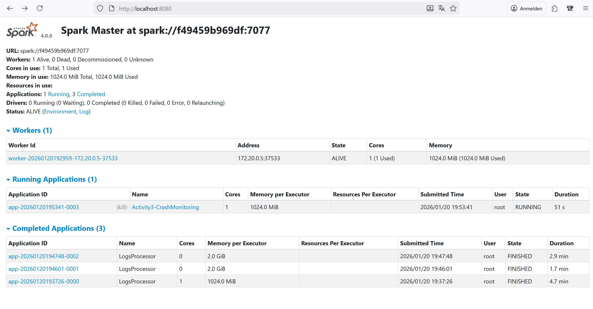
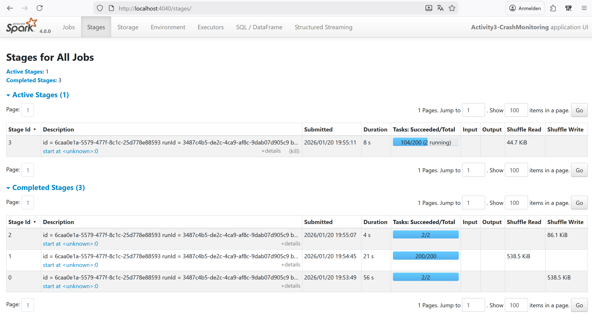
